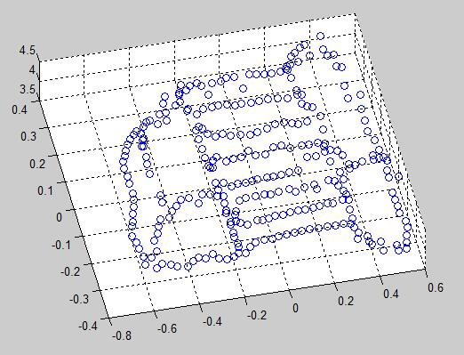
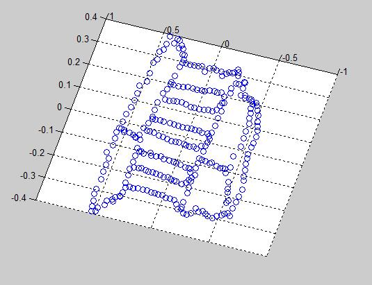
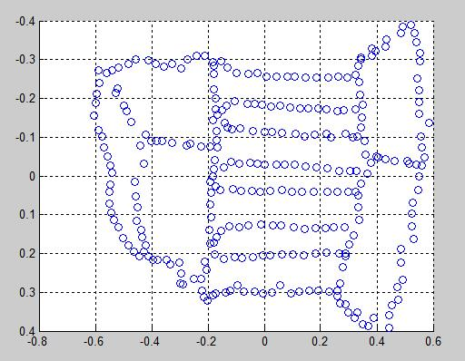
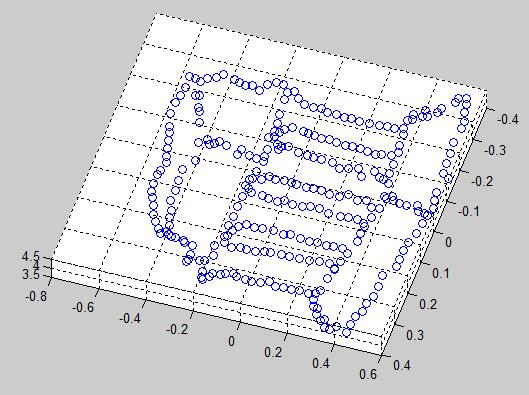

# 3D Reconstruction
Carnegie Mellon University

Robotic Institute

16720 Computer Vision: Homework 5

Instructor: Martial Hebert

TAs: David Fouhey, Heather Knight and Daniel Maturana

Due Date: January 13th, 2017

# Function Detail
## function F = eightpoint(pts1, pts2, M);
where pts1 and pts2 are N ¡Á2 matrices with the first column of each corresponding to coordinates in the first image and the second column corresponding to coordinates in the second image (the format returned by cpselect). M is a scale parameter. The 8-point algorithm (discussed in class, and outlined in section 10.1 of Forsyth & Ponce) is arguably the simplest method for estimating the fundamental matrix.

## function F = sevenpoint(pts1, pts2, M)

where pts1 and pts2 are 7 ¡Á 2 matrices containing the correspondences and M is the normalizer (use the maximum of the images¡¯ height and width), and F is a 3cell array of length either 1 or 3 containing Fundamental matrix/matrices. Use M to normalize the point values between [0; 1] and remember to \unnormalize" your computed F afterwards.

## function E = essentialMatrix(F, K1, K2)

Compute the essential matrix E given F and K1 and K2 
To obtain the Euclidean scene structure, first convert the fundamental matrix F to an essential matrix E. Examine the lecture notes and the textbook to find out how to do this when the internal camera calibration matrices K1 and K2 are known; these are provided in intrinsics.mat.

## function P = triangulate(M1, p1, M2, p2)

where p1 and p2 are the N ¡Á 2 matrices with the 2D image coordinates and
P is an N ¡Á 3 matrix with the corresponding 3D points per row. M1 and M2 are
the 3 ¡Á 4 camera matrices. 

## findM2.m 
To obtain the correct M2 from M2s by testing the four solutions through triangulations. You can use you own correspondences or the correspondences from temple/some corresp.mat. Save the correct M2, 2D points p1 p2 and 3D points P to q2 5.mat.

## function [x2, y2] = epipolarCorrespondence(im1, im2, F, x1, y1)

This function takes in the x and y coordinates of a pixel on im1 and your fundamental matrix F, and returns the coordinates of the pixel on im2 which correspond to the input point. The match is obtained by computing the similarity of a small window around the (x1; y1) coordinates in im1 to various windows around possible matches in the im2 and returning the closest.

## function [coordsIM1, coordsIM2] = epipolarMatchGUI(im1, im2, F)

This script allows you to click on a point in im1, and will use your function to display the corresponding point in im2. The process repeats until you right-click in the figure, and the sets of matches will be returned. 

## Q2_7.m

Now, we can determine the 3D location of these point correspondences using
the triangulate function. These 3D point locations can then plotted using the
MATLAB function scatter3. The resulting figure can be rotated using the Rotate
3D tool, which can be accessed through the figure menubar.

# Result
 
 

